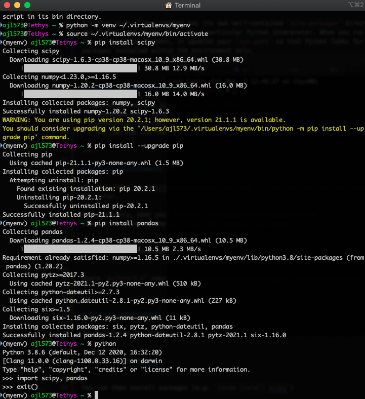

<!-- _class: lead -->

# Python Virtual Environments

Alex Lyttle | Skills Session | 14 May 2021

---
<!-- footer: 'Alex Lyttle | Skills Session | 14 May 2021' -->

# Overview

1. Prerequisits and definitions
2. Why do I need a virtual environment?
3. How do I create a virtual environment?
4. Will it work with Jupyter notebooks?
5. How do I manage different Python versions?
6. Live demonstration

---

# Prerequisites

This skills session assumes the following,

- Python >= 3.3
- Conda >= 4.6 (optional)
- IPython >= 6.0 (optional)

---

# What is Python?

Python is an interpreted programming language. To run Python code we need to install an *interpreter*. You may then access the interpreter with the `python` command in your *terminal* application.

- Your computer searches the `PATH` for the first script named `python`.
- Depending on your system or installation, this could correspond to Python 2 or 3.
- You may need to type `python3` if both versions are installed.

---

# What is Conda?

Conda is a package and environment management system. Unlike `pip`, Conda can be used to manage environments with multiple programming languages.

If you installed Python with Anaconda, it is managed by the Conda environment named `base`. You can use the `conda` command in the Anaconda Prompt, or in your terminal after you use `conda init` to configure your `PATH`. Use `conda activate` to access the `python` command.

---

# What is `pip`?

You can install many packages, available locally, or remotely via the Python Package Index (PyPI), through the Python module `pip`. Using the `pip` command in your terminal,

- Your computer searches the `PATH` for the first script named `pip`.
- This may not correspond to the version of Python you want to use!
- If unsure, use `python -m pip` where `python` is your chosen version.
- Use `python -m pip --user` to install packages to your user, not system-wide.

---
<!-- _class: lead -->

> Help! I updated a Python package and now my code is broken!

---

# Example

We want to run a script `myscript.py`

- Imports some packages called `foo` and `bar` available on PyPI
- `bar` *depends* on a specific version of `foo`

We type the following into our terminal,

```bash
python -m pip install foo bar  # Installs script dependencies
python myscript.py             # Runs the script
```

---

# Example

Later, we update `foo` to use a new feature,

```bash
pip install --upgrade foo
```

We run `myscript.py` again, but now there's an error! The `bar` package doesn't work with the updated `foo` package.

---

# Why a virtual environment?

When you install `foo` and `bar` they are put in the `site-packages` directory associated with your Python interpreter. This is where Python accesses the package when you run code.

When you install a package, it may have *dependencies* &mdash; i.e. other required packages. Sometimes dependencies must be a *particular version* in order for a package to work. **Therefore, if you update one package, it could break another.**

---

# What is a virtual environment?

- Allows you to keep dependencies required by different projects separate
- Updates your `PATH` to prioritise a specific Python interpreter
- Has its own isolated `site-packages` directory
- Updates your `sys.path` so that Python looks for packages installed within the isolated `site-packages` directory only

---

# How do I make a virtual environment?



- Depends on how you installed Python
  - Anaconda uses `conda` to manage environments
  - `venv` comes with Python 3
  - Or, the `virtualenv` package

---

# Virtual environments with `conda`

If familiar, you can use Anaconda  Navigator. 

Alternatively, open your **Terminal** or **Anaconda Prompt** and use the `conda create` command to setup an empty virtual environment. For example,

```bash
conda create --name myenv python=3.6
```

where `python=3.6` specifies the Python version you want for the environment.

---

# Virtual environments with `conda`

To *activate* the environment at any time,

```bash
conda activate myenv
```

Then, you may install packages (e.g. `conda install scipy`).

To *deactivate* the environment,

```bash
conda deactivate
```

---

# Virtual environments with `venv`

- The simplest way to get started without `conda`
- Only works with Python 3 (for Python 2 see `virtualenv`)

---

# Virtual environments with `virtualenv`

- The simplest way to get started without `conda`
- Only works with Python 3 (for Python 2 see `virtualenv`)

---

# Virtual environments with `virtualenvwrapper`

- The simplest way to get started without `conda`
- Only works with Python 3 (for Python 2 see `virtualenv`)

---

# Jupyter Notebooks

Assuming Jupyter is installed on your computer. What if you want to run a Jupyter Notebook within your virtual environment?

**No need to install Jupyter in every environment!**

You only need to install the IPython kernelspec for that environment.

---

# Jupyter Notebooks - `conda`

https://ipython.readthedocs.io/en/stable/install/kernel_install.html

```bash
conda activate myenv  # make sure we are in myenv
conda install ipykernel
python -m ipykernel install --user --name myenv --display-name "Python 3 (myenv)"
```

---

# Jupyter Notebooks - `pip`

```bash
source ~/.virtualenvs/myenv/bin/activate  # if using venv or virtualenv OR
workon myenv                              # if using virtualenvwrapper
pip install ipykernel
python -m ipykernel install --user --name myenv --display-name "Python 3 (myenv)"
```

---
<!-- _class: lead -->

> Help! I updated Python and now my code is broken!

---

# <!--fit--> How do I manage different Python versions?
